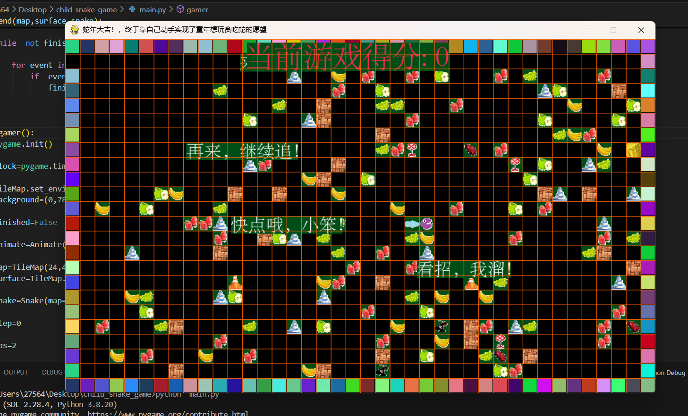
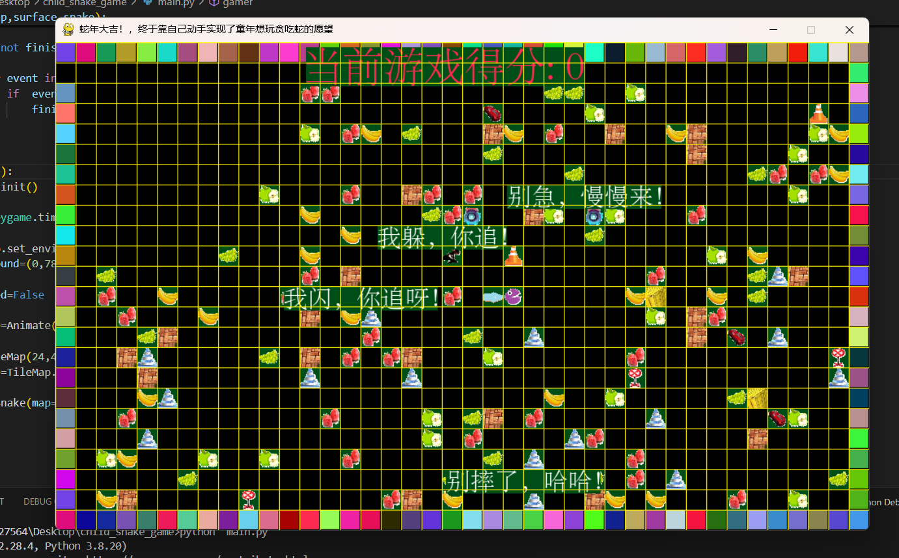

# greedySnake
implement a greedy snake game  which deeply  impresses me when i am a child

# Python Snake Game: A Nostalgic Coding Journey

This Python-based Snake implementation reimagines the classic arcade experience through modern programming practices. Designed as an educational project for coding beginners, it demonstrates:

 ✔️ Core Programming Concepts: Object-oriented design, collision detection, and score tracking
 
 ✔️ Beginner-Friendly Architecture: Clean modular structure with detailed code comments
 
 ✔️ Customization Ready: Easily modifiable parameters (grid size/speed/visuals) via config.py

# Educational Value:
Ideal for learning game loop mechanics and event handling

Showcases Pygame integration with 200+ lines of didactic code

Includes debugging tips and performance optimization notes

# License & Attribution:
Developed by XuJu Zhong (钟旭炬) under GPL-3.0 license.
▸ For source code sharing/modification:
Retain original author credit in header comments
Preserve license file in distribution

# Contact Developer:
📧 2756447543@qq.com

📱 (+86) 182-7648-9248

Your feedback and suggestions are valuable for improving this learning resource!

# Begin playing snake game 
to begin the snake game:

    use ArrowUp         ^   for                    up control;
    
    use ArrowLeft       <   for                    left control; 
    
    use ArrowRight      >   for                    right control;
    
    use ArrowDown  (you can guess it !) for        down control;

have a fun!

# Game Demo

you can  also  watch the video game demo on douyin 

1.25 08/16 X@m.Dh Xmd:/ # 编程 # 游戏制作 # DIY 终于玩上了自己亲手制作的贪吃蛇 算是对以前没得玩的补偿吧 X﹏X 简易版  https://v.douyin.com/aXj549Fa_go/ 复制此链接，打开Dou音搜索，直接观看视频！ 

